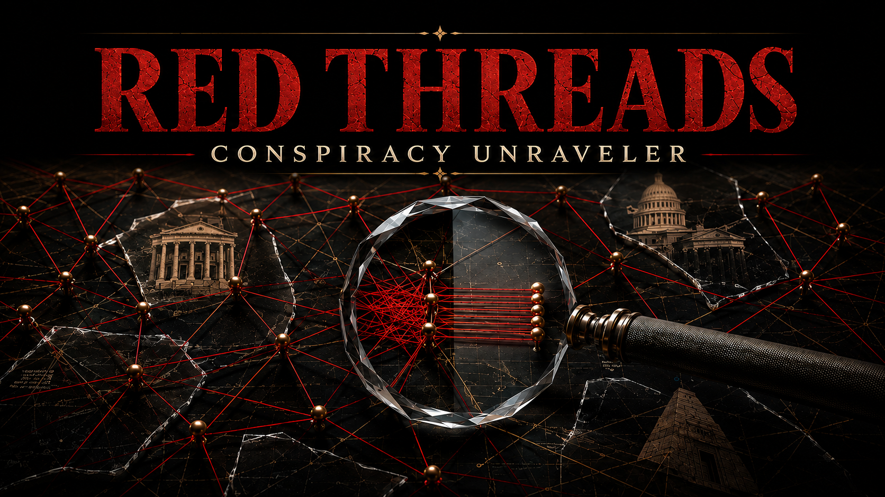

# RED THREADS — Conspiracy Unraveler

**Pull the thread. Find the mechanism.**



A grant. A board seat. A shared adviser. Three articles repeating one claim. Interesting connections. Now make them earn their meaning.

RED THREADS gives your AI investigative craft for following money, resources, obligations, influence, and decision rights. It helps turn a hunch or a pile of records into a source-linked case, competing explanations, useful next leads, and an interactive atlas you can inspect offline.

**[Explore the fictional demo](https://stunspot.github.io/red-threads/demo.html)** · **[Download v0.1.0](https://github.com/Stunspot/red-threads/releases/download/v0.1.0/red-threads-v0.1.0.zip)** · **[Install](documentation/installation.md)** · **[Run your first case](documentation/first-case.md)**

## See what a connection actually carries

In the fictional Meridian case, a foundation awards a research grant, holds approval rights over one funded brief, and requests revisions within that scope. The records support that specific mechanism. A claim that the same foundation commands a separate company still needs its own evidence. Three retellings of the grant announcement do not supply it. The corkboard has standards.

Open a relationship to inspect its verb, status, dates, and source. Follow reporting back through its recorded origins. Compare explanations and their next tests. Explore what disappears when you filter tentative links or remove a node from the visible network. Save the view, preserve the case, and return to the unanswered question.

## Bring a question, not a perfect dossier

After [installing the skill](documentation/installation.md), give your host the records it may use and try:

```text
Use RED THREADS to investigate this transcript. Map the money,
people, resources, and decision rights behind it. Show a useful
first neighborhood, distinguish documented links from hypotheses,
and follow the record most likely to change the explanation.
Keep the case and evidence notes in my chosen workspace.
```

Your starting suspicion can stay in the case as an attributed working hypothesis. RED THREADS supports serious rival explanations, identity reconciliation, financial comparisons, actor incentives, source corrections, and investigations that continue across sessions. It preserves the caller's identity and voice.

For a guided example with no private records or AI account required, start with the [demo and first-case walkthrough](documentation/first-case.md).

## What you get

This is one self-contained AI skill: instructions, investigative references, knowledge playbooks, an original fictional case, Python tools, and an offline HTML atlas. The host supplies the language model, browsing, document access, and any research tools. No separate Augment, persona, API key, or server is required by the package.

Python 3.10+ is required for the bundled case tools and atlas generation. Conversational investigation can proceed without Python; creating the atlas needs it. Viewing an already generated atlas needs a modern browser with JavaScript. The case tools use Python's standard library.

The canonical investigation lives in `case.json`. The atlas and CSV exports are views of it. Source changes can be traced through declared evidence dependencies into relationships, explanations, games, and leads. That trace identifies what needs review; the investigator still decides what the correction means.

## Keep the interesting distinctions

Funding, agreement, coordination, and control can coexist. Each needs evidence for its own mechanism. A successful validation checks the case's structure. A shortest path shows a route in the recorded network. A probability records an assessment. None of those is an automatic truth verdict.

Version 0.1.0 has local toolkit and extracted-package checks plus an unfamiliar fictional-record inquiry and a separate correction/resume exercise. Fresh-host installation and discovery, live-web accuracy, and a quantified performance rating have not been established. See [evidence, scope, and licenses](documentation/evidence-and-licenses.md).

## Keep going

The [documentation hub](documentation/README.md) connects installation, investigation, exact commands, correction, privacy, and support. [Recovery](documentation/recovery.md) starts from the error or missing capability you can actually see.

Created by Sam “stunspot” Walker / Collaborative Dynamics, with Nova. Deterministic software is MIT-licensed; original authored material is CC BY-ND 4.0, with upstream CC BY 4.0 rights preserved. Read the [license](LICENSE.md), [provenance](src/red-threads/references/provenance.md), and [trademark notice](TRADEMARKS.md) before redistributing.

Useful to someone with an institutional hairball on their desk? Share the [demo](https://stunspot.github.io/red-threads/demo.html). Let them pull a thread before asking them to install the toolbox. 🌐‍💠